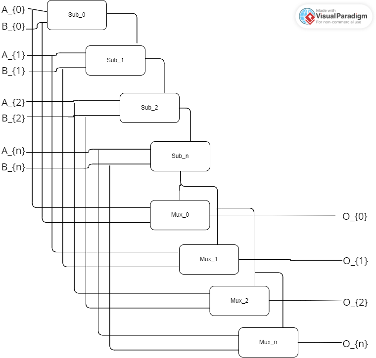
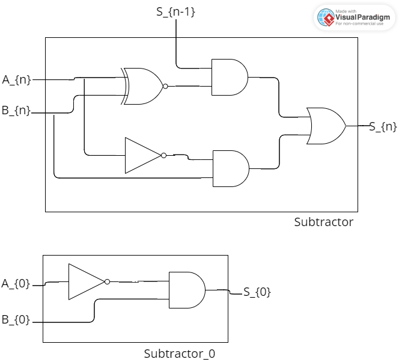
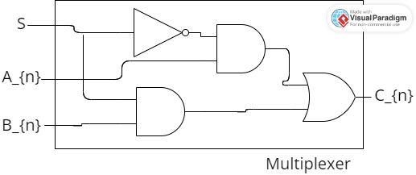

# 1. Multi party computation for maximal value of two sets

### 1.1. Content

1. [Introduction](#12-Introduction)
2. [Instalation and requirements](#13-Installation-and-requirements)
3. [Execution](#14-execution)
4. [Theory](#15-theory)
5. [Implementation](#16-implementation)
6. [Final remarks](#17-final-remarks)

### 1.2. Introduction

This project implements a computation of maximal value of two set of numbers, alongside the verification, if the computation was done correctly. It is prepared for Introduction to Cybersecurity course on University of Klagenfurt, Austria.
Project is an extension to already existing implementation of Yao protocol, designed and coded by Olivier Roques and Emmanuelle Risson. Original code can be found on [their GitHub repository](https://github.com/ojroques/garbled-circuit).
The main task of the project was to prepare program allowing the communication and secure computation of data between two parties. Data was to be at least four bits of size. In my implementation it is exactly four bits, but the extension to bigger size should not provide any problems.
Two parties are traditionally called Alice and Bob. Bob serves as a server, he listens to communication and responds whenever new message appears. Alice is the client, the initiator of the communication. She provides the circuit and finishes execution, when the protocol is completed.

### 1.3. Installation and requirements

This code was written and tested on Python 3.9, under Windows 10 21H2 Operating System. Code doesn't use any additional libraries or packages, beside those required by original Yao.
Official requirements with explanation can be found in README file, provided by authors of Yao.
Code was run under Windows, using PowerShell, git bash console and Pycharm embedded console.

### 1.4. Execution

My implementation uses the same format of command as original implemetation. To run execute command:

```powershell
python src/main.py <party>
```

where party is equal to "bob" or "alice". The command is formatted in such a way, that executing the task does not require any additional arguments. Nevertheless, the list of arguments is as follows:

* -c: path to circuit file saved in json format, by default 4bit_max (default path is from root folder, not from src).
* -m: printout mode. Possible values are "circuit" (default), "table", and "none". In the case of running Alice or Bob, there is no difference between "circuit" and "table". "none" will result in skipping the evaluation process, and limit the execution only to necessary information exchange.
* -l: logging level. By default, set to warning. Run with "debug" to see the whole process of communication step by step.
* -f: path to file with data. By default, is empty, and data is read from the console.
* -b: Length of numbers in input in bits. By default, set to 4.

Use -h flag to learn more.
Bob uses only paramteres -f and -l, rest is ignored.
Some useful commands:

```powershell
python src/main.py alice 
# run Alice on default settings
python src/main.py bob -f src/data/bob.in 
# run Bob using file input
python src/main.py alice -c src/circuits/4bit_max.json -f src/data/alice.in -m none -b 4 -l debug 
# run Alice with each parameter specified
python src/main.py -h 
# help
```

While using bash based console, type ``./src/main.py`` instead of ``python src/main.py``. Each party needs to be executed from different console instance (works also between different shells).

#### 1.4.1. Output

Both sides will start by printing the prompt for input or confirmation of reading from file. When the communication starts, Bob will confirm receiving the circuit ("Received ``name``"). If the evaluation is requested, it will be printed next on Alice side (consult the documentation of original implementation for further information).
After the communication finishes, both sides will print message "Result of function is ``n``".
Alice will print out the result of verification in form of "Result of verification: True/False", while Bob will give the proper explanation: If everything is correct, he will print "Verified correctly", otherwise, "Error! Through transfer obtained: ``a``, correct value: ``b``".

### 1.5. Theory

#### 1.5.1. Circuit

##### 1.5.1.1. Overview

The project uses the logic circuit to calculate the maximum value of two four bit long integers. It utilizes the idea of comparison by subtraction, according to which, if we subtract B from A, we can decide, which one of them is bigger based on the sign of result.
Circuit consist of two main parts: chain of subtractors and set of multiplexers.

<figure>


<figcaption align = "center"><b>Fig.1 - Full circuit</b></figcaption>
</figure>

##### 1.5.1.2. Subtractor

Subtractor is a simple circuit based on the idea of adder. The modification in this case is, that we are interested only in the borrow bit, and not in the full result of the operation. Therefore, the main output wires are omitted, and the only output, that we are interested in is the final borrow bit, denoted as S<sub>n</sub> on the figure. The chain consist of multiple instances of exactly the same subcircuit. The only difference is with the first one, denoted Sub<sub>0</sub>. Because we know, that borrow bit in this case is always equal to 0 we can simplify the circuit and use only two gates (``not`` and ``and``) instead of normal 5. The data is given to the circuit from the least significant bit up.

<figure>


<figcaption align = "center"><b>Fig.2 - Subtractors</b></figcaption>
</figure>

The chain of subtractors answers the logic question: is B greater than A.

##### 1.5.1.3. Multiplexer

After executing the chain, the resulting bit is fed to the set of multiplexers. Each one of them denoted as Mux<sub>n</sub> has two data inputs, corresponding to bits of numbers in input (A<sub>n</sub> and B<sub>n</sub> respectively) and one steering input, to which the result bit from subtractors is passed (denoted S). The result is the value of selected bit (either from A or from B), denoted as C<sub>n</sub>. The list of C bits, ordered in the same fashion as input bits, gives the bigger of two numbers.

<figure>


<figcaption align = "center"><b>Fig.2 - Multiplexer</b></figcaption>
</figure>

In order to minimize the amount of used gates, the ``not`` gate is constant and created only once.

##### 1.5.1.4. Summary

The whole circuit consist therefore of:

* $ n-1 $ XNOR gates (one for each Sub, except for the first one)
* $ n+1 $ NOT gates (one for each Sub, and one additional for Muxs)
* $ 2n-1 $ OR gates (one for each Sub, except for the first one and one for each Mux)
* $ 4n-1 $ AND gates (two for each Sub, except for the first one, which uses one, and two for each Mux)

Which makes $ 8n-2 $ gates in total. The main advantage of this circuit is its ease of extension. To add additional bits, only thing required is to append additional subcircuits to the existing ones.

#### 1.5.2. Alice

1. Alice start by creating instance for herself, based on general YaoGarbler class. She instantiates all needed variables, reads data either from console or from file (constructor of the class) and saves only the maximal value of that input. This uses the observation, that $ max(A||B) = max (max(A), max(B)) $, where ``A`` and ``B`` are two lists and ``||`` is concatenation operator.
   On this step, the circuit is also garbled and probability bits are created (using code from original implementation).
2. Alice creates a dictionary containing data, that will be sent to Bob.
   * circuit, received from execution argument;
   * garbled_tables, obtained in previous step
   * pbits_out, probability bits, also from previous step
   * printout, style of printing the evaluation process (in the default form of circuit, or skipped), received from execution parameters
   * bitlength, bit length of accepted data, received from execution parameters
     After that, the communictaion begins and data is sent to Bob
3. If the parameter printout is set to "circuit", then the circuit is evaluated with Bob. Tht means, that Alice sends all possible values of her input, and combines it with all possible inputs from Bob. Then obtained data is fed to circuit via Oblivious Transfer (from original implementation). The table presenting generated values is printed on Alice console.
   If parameter is set to "none", this step is omitted.
4. Alice proceeds with her main function, called ``calculate_response``. She repeats the instructions from the previous step, but this time using only her own input. Bits of her input are xored with probability bits, combined with keys and assigned to wires. This is then sent to Bob via oblivious transfer. After execution Alice receives the maximum value between her input and Bob's.
   She prints out her result in the form of single integer.
5. Alice initiates the verification of the protocol. She makes new dictionary, that is to be sent to Bob, containing the maximal value of her inputs and the value obtained via protocol and send it. When Bob acknowledges the receiving, she sends another message (in a form of handshake) and waits for response. Then she prints the result of the verification received from Bob.
6. Alice finishes her execution.

#### 1.5.3. Bob

1. Bob starts by instance for himself. He instantiates all the required variables and reads data from console or from file and saves the list of inputs.
2. Bob opens channel and starts to listen.
3. When the new message comes, he checks it length. If it's equal to 5, proceeds with main part of communication (step 4). If it's equal to 2, he verifies result (step 8). In any other case he reports an error and stops working.
4. Bob cleans up his data according to rules received from Alice (removes all entries that exceeds upper limit)
5. If Alice requests evaluation of the circuit, Bob responds with all of his possible inputs and execution of oblivious transfer. (Function from original implementation)
6. Bob receives proper input from Alice (through the circuit, so he doesn't know the real value) amd calculate the response. He assigns bits of his private value to wires and through oblivious transfer (from original implementation) gains the general maximal value between his inputs and Alice's. He prints out the result in the form of single integer.
7. Return to step 2.
8. If Alice requests a verification, Bob starts the procedure, waits for confirmation of transition (it is needed to switch the socket from constant listening to responding). He takes the value received from Alice compares it with his own, calculates the max value and compares it with the one obtained through protocol. Bob prints the message with the status of verification and sends the result back to Alice.
9. Return to step 2.

## 1.6. Implementation

Most parts of the code is kept from original. The code has been refactored, with separate classes moved to respective files.

### 1.6.1. garbler.py

This file contain the YaoGarbler and LocalTest classes. The only change applied to this file is the addition of one more possible value to -m flag ("none"), which in the case of LocalTest will produce the same output as "circuit".

### 1.6.2. util.py

No changes here, only the original code.

### 1.6.3. ot.py

Contain the definition of oblivious transfer. Only difference is, that function ``send_result`` returns the obtained value. Rest of the code form original implementation.

### 1.6.4. util_karol.py

This file contain some utility functions required in my implementation.

#### 1.6.4.1. cleanup

Takes list of integers ``line`` and integer describing the upper bound ``lim`` as input and returns the list with omitted values negative and bigger than (or equal to) the upper bound.

#### 1.6.4.2. circuit_output_to_int

Takes as an input dictionary ``d`` formated as the output of the circuit ``{no_of_wire: bit}``and converts it into single number (combines the bits into bigger binary number and changes the base).

#### 1.6.4.3. private_func

Inputs:

* ``name``: type: string; default: ""; name of the party, used for convenience in the prompts.
* ``bit_size``: type: int; default: 16; length of the numbers (in bits) allowed on input
* ``file_read``: type: bool; default: False; if input is obtained from file or from console
* ``filename``: type: string; default: ""; path to the file with input data. It is analyzed only if ``file_read`` is set to true.
* ``data``: type: list; default: []; list of inputs. If this is set, it replaces other input methods.

Outupt:

1. ``line``: type: list; list of integers obtained from any output methods.
2. ``local_max``: type: string; maximum value of the inputs, in binary form.

Execution will start with prompts about input or confirmation of reading from file. If file is not found, it will output an error. Data is then cleaned (see: [section cleanup](#1641-cleanup)) and max is calculated using build-in function. The result is transformed to binary and filled with leading zeros.

### 1.6.5. alice.py

#### 1.6.5.1. _ _ init _ _

Takes three new inputs:

* ``print_mode``: defines, if the evaluation of the circuit should be performed (if "circuit") or not ("none").
* ``filename``: path to the file, from which to read the data
* ``bit_size``: length (in bits) of integers allowed in the input

All of those variables are provided from execution command.
Function executes parental init function and then saves all the parameters as attributes. Calculates the max of the input (see: [section private_func](#1643-privatefunc)).

#### 1.6.5.2. start

No input.

This function serves as a spine for the execution.
Creates the dictionary to be sent to the other party (see [section Theory/Alice](#152-alice) for further information). If necessary, does evaluation of the circuit (function print from original implementation). Calculates the response (see: [section calculate_response](#1653-calculateresponse)) and verifies protocol (see: [section alice.py/verify](#1654-verify)).

#### 1.6.5.3. calculate_response

This function is heavily based on the original implementation, with solutions inspired by AJ Wisniewski ([github](https://github.com/awisniewski21/garbled-circuit))

Input: ``entry``: type: dictionary; created using original implementation.

Instead of passing through all possible inputs, it maps the private max value to the wires and sends this. At the end output (which is originaly in the form of dictionary {no_of_wire:bit}) is converted to integer and saved as an attribute for further use. Prints out the output.

#### 1.6.5.4. verify

No input.

Creates a dictionary with two values: max of Alice inputs and value obtained through the execution of protocol. Sends this data to other party. After receiving confirmation answers with another message ("connection established", but that value is never used, so it is only for convenience). This allows the function to establish temporary communication channel between parties. After receiving the result of verification, prints it.

Other Functions left without changes.

### 1.6.6. bob.py

#### 1.6.6.1. _ _ init _ _

Takes one additional input: ``filename``, the path to the file from which to read the data.

Proceeds with creating all the necessary attributes (from original implementation). Attributes data contains the saved list of inputs (by default limited to 16 bits of length).

#### 1.6.6.2. listen

No input.

This function serves as a spine for the execution.
After receiving each message, function confirms it by sending True. Then based on the length of the received dictionary, cleans up the input (see [section util_karol.py/cleanup](#1641-cleanup)) it provides evaluation (if needed, original function send_evaluation) and calculates response (see: [section send_response](#1663-sendresponse)), or verifies the protocol (see: [section bob.py/verify](#1664-verify)), or prints out error message and stops execution. The execution will run, as long as no error occurs, or it is stopped by Keyboard Interrupt.

#### 1.6.6.3. send_response

This function is heavily based on the original implementation, with solutions inspired by AJ Wisniewski ([github](https://github.com/awisniewski21/garbled-circuit))

Input: ``entry``: type: dictionary; created using original implementation.

Maps Bob's input to wires and proceeds with the OT execution. Result of the transfer is printed in the form of single integer.

#### 1.6.6.4. verify

Input: ``entry``: dictionary containing two values: Max of other party's inputs and the value obtained from protocol.

After establishing communication, calculates max of private value and the value from dictionary (other party's max) and compares it with the value obtained from protocol. The result of comparison is printed alongside the proper message and is transmitted back to other party.

### 1.6.7. main.py

This file is responsible for the execution of the program. It contains the argument parser (from original implementation, but extend to new, necessary values).
The constant value ``PRINTOUT`` is responsible for the default value of the print mode, currently set to "circuit".

For more information check the files for comments and docstrings.

## 1.7 Final remarks

Coded by Karol Wesołowski (University Klagenfurt/Poznan University of Technology) as a final project for the Introduction to Cybersecurity course on University Klagenfurt, Austria.
Coded using jetbrains Pycharm.
Circuits graphics generated using Visual Paradigm.
Tested under Windows 10 Home.
Documentation prepared in Markdown.
Version control using git, repository shared on github: https://github.com/KarolWes/i2cs_project
Based on code by Oliver Roques, Imperial College London: https://github.com/ojroques/garbled-circuit
Communication between parties inspired by solution by Austin J. Wisniewski, The University of Illinois Urbana-Champaign: https://github.com/awisniewski21/garbled-circuit
April 2023, Klagenfurt, Austria

